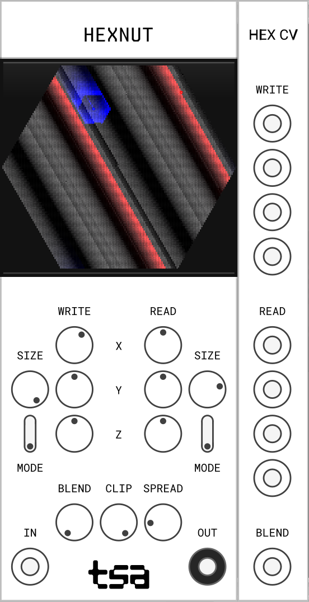

# Harmonic Anomalies

## HexNut

Three dimensional looper.

### Donut Reborn

Inspired by our [Donut™ app](https://www.youtube.com/watch?v=mITLz1rrSN0) from a decade ago, HexNut is a looping buffer, that can be accessed along different axes. By reading and writing along one axis, you can create loops, echoes, and the like. But venturing off-axis yields the truest grit.

### Controls

#### Mode

HexNut has 3 modes, as follows.

1. Vector - Data is accessed by following a vector determined by the Write or Read `X`, `Y`, and `Z` controls.
1. Ring - Data is accessed along a ring determined by the `SIZE` parameter.
1. Vortex - Data is accessed by spiraling within a ring determined by the `SIZE` parameter.

#### Vector

There are two sets of access controls, one for writing, `WRITE`, and one for reading, `READ`. Each set controls, from top to bottom, the vector according to which the read and write heads move through the buffer. Double-clicking a control sets it to zero, which can be quite handy to limit movement to a given axis.

#### Blend

The `BLEND` parameter controls how much writing mixes with content already in the buffer. To fully overwrite, set the control fully clockwise. To have no effect when writing, set it fully anticlockwise.

#### Clip

The `CLIP` parameter truncates the buffer, which has the effect of changing loop timing.

#### Spread

The `SPREAD` parameter uses a ring around the read head to read surrounding data. Its effect is often similar to that of a chorus or doubler effect. It will slightly increase output volume, as more data is summed together.

### Expander

The `Hex CV` expander allows you to control the read and write vectors, the ring sizes, and writing blend with control voltage. In each section, the controls are arranged in the following order: `X`, `Y`, `Z`, `SIZE`.

## Acknowledgements

A huge thanks to [Red Blob Games](https://www.redblobgames.com) for helping me to think through [hexagonal grids](https://www.redblobgames.com/grids/hexagons/#coordinates).
